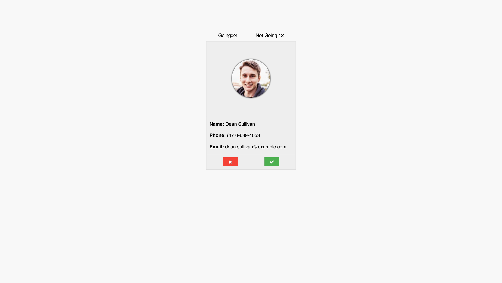
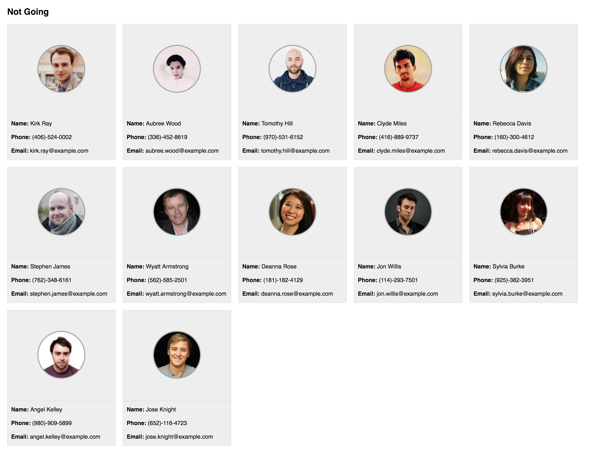

# Invite Full Stack

## Description
Welcome to your first full stack homework.  This is going to use both Spark as well as a front end you create. The goal is to create an evite type of program which will display 1 user at a time and then you can select yes or no on whether to invite them.  It will use the random person generator
[api](https://randomuser.me/) to display each person to show.

## Requirements

### Front End
* Layout the pages as shown in the screen shots below.  
* There will be 3 pages invite, going and notgoing.
* Invite Page
	* Use Ajax to display 1 [random user](https://randomuser.me/) as someone to invite or not
	* Show the user buttons to accept or reject the user
	* Show the counts of those going and those not going as provided from the back end
	* When clicked the button should submit the data to the back end via a form with hidden inputs created with the javascript
* Going/Not Going
	* Display all the users who are going or not going depending on the page
	* Layout as shown in the screenshot
* Convert the html to use moustache tags where needed
* Put all assets in the templates directory in your project

#### Invite

#### Going

#### Not Going

### Back End
* Create a Spark app with Maven
* Create a `Invitee` class that stores all the info for the random user when submitted
* Create a route for "/" that will display the invite page with the user counts
* Create a route for "/going" that will display the going template and pass all those going to the event.
* Create a route for "/notgoing" that will display notgoing template and pass all those not going to the event.
* Create a POST route for "/mark-invitee"
	* Take the information POST about the user and store it in a `HashMap<String, Invitee>` or `ArrayList<Invitee>`
	* Don't forget to mark the user as going or not going
	* When the information is stored redirect to "/"

## Hard Mode
* Store all invitees in a postgres database
* Authentication
	* Add a login page that will log the user in
	* Use the session to store the user (or username if you prefer)
	* Attach the username of the user who accepted/rejected an invitee to the `Invitee` class
* Now that we have a login only allow people who have logged in to approve/reject an invitee.  Simply disable the buttons if there is no logged in user.

## Nightmare Mode
* Change your back end to have `/mark-invitee` accept json data coming in and return json back out
* Change the front end to use ajax to post directly to the back end when an invitee is approved/rejected.

## Resources
* [Github Repo](https://github.com/tiy-lv-java-2016-11/invite-fullstack)
